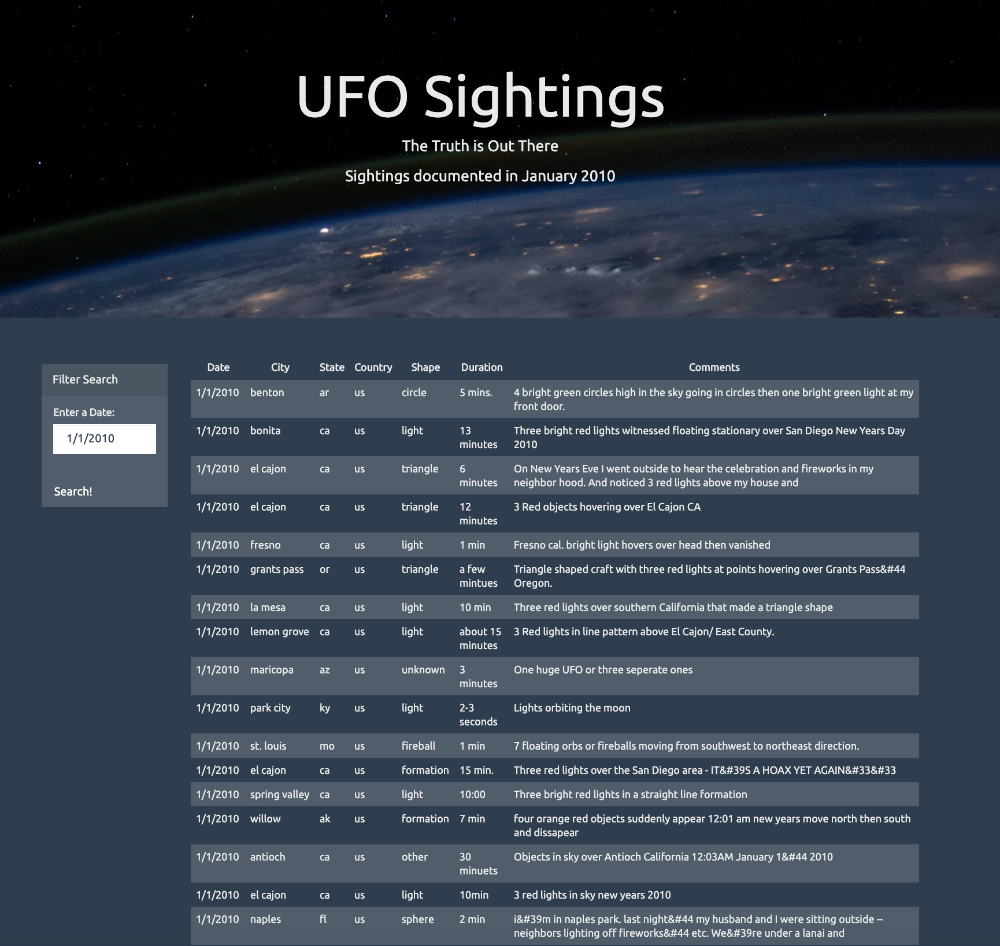

# JavaScript and DOM Manipulation: UFO_Sightings

The goal of this project is to:
* Create a basic HTML web page to display UFO sighting data in the [dataset](static/js/data.js).
* Write a code that will take user input (date) and search through the appropriate column in the dataset.
* Using the dataset provided in the form of an array of JavaScript ovject, write a code that appends a table to the web page that display the search results for each UFO sighting. 

Tools used in this project includes:
* JavaScript
* HTML
* CSS
* D3.js

Example output of search result:

